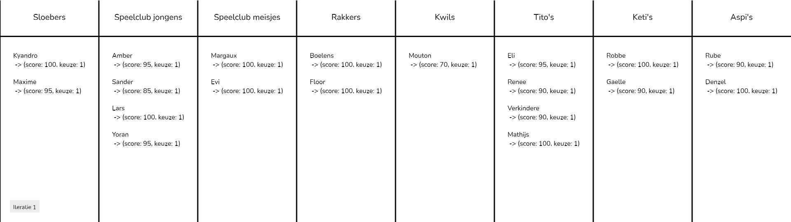

# Groupie

Programma'tje om het verdelen van leiding over verschillende groepen te automatiseren op basis van een persoonlijke score (0-100) per groep.

Deze score omvat het gewicht waarmee een bepaald persoon leiding wil geven aan een bepaalde groep.

## Meest courante problemen bij typische top 3

- Indien meerdere personen eenzelfde groep als 1e keuze hebben aangeduid, kan enkel een naieve, willekeurige verdeling gemaakt worden.

  > **Stel**: 7 mensen hebben de aspi's als 1e keuze. Hoe determineer je welke 2 mensen leiding mogen geven aan de aspi's, en welke 5 hun 2e of 3e keuze krijgen?

  > **Stel**: 4 mensen hebben exact dezelfde top 3. Hoe determineer je wie welke keuze krijgt?

- Indien een bepaalde groep in niemand zijn top 3 staat, is het onmogelijk om te beslissen welke mensen hier leiding aan zullen geven.

- Het is onmogelijk om aan te geven hoe gelukkig je zou zijn met je 2e of 3e keuze. Sommige mensen zijn subjectief gelukkiger met hun 3e keuze dan andere met hun 2e keuze.

  > **Stel**: Voor persoon A maakt de groep eigenlijk niet veel uit. Deze persoon zou heel graag de Aspi's leiding geven maar tergelijk ook de Sloebers of de Keti's.

  > **Stel**: Persoon B is daarentegen helemaal gek van de Rakkers. Deze persoon zou eventueel ook wel leiding willen geven aan Speelclub meisjes maar ziet daarnaast eigenlijk weinig groepen zitten. Als 3e keuze zet deze persoon dan maar Speelclub jongens om tot 3 te komen.

Deze nuances zijn in een klassiek top-3 model onmogelijk te achterhalen. Dit heeft als gevolg dat er veel minder rekening kan gehouden worden met individuele wensen

## Voorbeeld score model:

Indien je heel graag een bepaalde groep wilt begeleiden geef je deze een score dicht tegen de 100%. Indien je ook een andere groep graag zou begeleiden, kan je deze eveneens een hoge score geven.

Indien je sommige groepen wel ziet zitten kan je dit aangeven door een lagere score te geven, zo kan je het bv 70% zien zitten om leiding te geven aan de keti's en slechts 45% zien zitten om leiding te geven aan de tito's.

Als laatst kan je ook aangeven welke groepen je totaal niet ziet zitten, deze zou je eerder richting de 0% scoren. Zo kan je het bv maar 5% zien zitten om leiding te geven aan de Sloebers of de Rakkers.

Deze manier van scoring laat je toe om **nuances** aan te geven over de verschillende groepen. Het schetst een beter beeld over hoe tevreden je bent met je 2e of 3e keuze, waardoor het programma een betere inschatting kan maken over het geven van je 1e, 2e, of 3e keuze.

## In actie

Hieronder volgt een voorbeeld van het programma op willekeurige data. (Nieuwe leiding kan inderdaad geen leiding geven aan Aspi's, de score-bepaling is compleet random en illustratief)

### Stap 1: Iedereen wordt bij zijn eerste keuze gezet

### Stap 2: Te veel leiding bij de Speelclub jongens

Het programma detecteerde hier te veel personen. Er wordt gekeken naar de score van de volgende keuze van elke persoon. De personen met de hoogst scorende 2e keuze worden naar hun 2e keuze verplaatst. De personen die te veel score-punten zouden moeten inboeten worden behouden. Hier zie je dat Lars verplaatst wordt naar zijn 2e keuze (de tito's). Desondanks heeft deze keuze nog steeds een score van 95%. Dit terwijl Sanders slechts een score heeft van 85% voro zijn eerste keuze. Hier zie je duidelijk dat Lars het minder erg vind om zijn 2e keuze te krijgen dan Sander. Dit zorgt er voor dat we Lars vergooien van groep en Sander niet.

## Te veel leiding bij de Tito's

Het programma detecteerde hier te veel personen. Er wordt opnieuw gekeken naar de volgende keuze van elke persoon die momenteel aan deze groep hangt. De personen met de beste volgende keuze worden naar hun volgende keuze verplaatst.

> Hier zie je opnieuw duidelijk dat mensen die het minder erg vinden om hun 2e keuze te krijgen, deze rapper zullen krijgen dan mensen die minder graag hun 2e keuze willen

### Te veel leiding bij de Rakkers

Opnieuw worden de mensen met de laagste scores voor hun volgende keuze behouden bij de Rakkers. De mensen met een relatief hoge score voor hun volgende keuze worden aan hun volgende keuze toegewezen.

## Te veel leiding bij de Keti's

Hier zien we dat we iemand hebben gevonden die bij de Kwils wilt staan, waardoor elke groep minstens 2 leiders heeft. Deze staat is optimaal aangezien er zo min mogelijk vershuivingen zijn gebeurd sinds het begin (ideale situatie voor iedereen (iedereen zijn keuze met de hoogste score)). Elke groep die momenteel met meer dan 2 leiders staat kan nog eens kijken welke personen eventueel nog willen wisselen met andere groepen, of welke groepen meer deugd zouden hebben van een 3e persoon.

